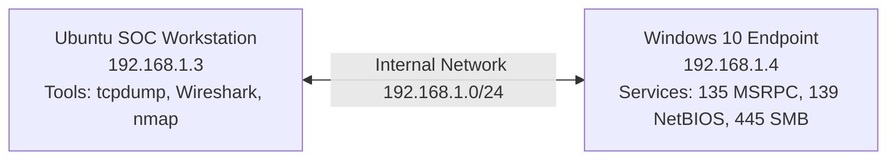

# Lab Architecture – SOC Network Traffic Analysis

This repo uses a small isolated home-lab network to generate and analyze traffic like a SOC analyst.

## Overview
- **Ubuntu SOC workstation:** `192.168.1.3`
- **Windows 10 endpoint:** `192.168.1.4`
- **Virtualization:** VirtualBox
- **Network:** Internal network `192.168.1.0/24`

## Diagram (Mermaid)
> GitHub renders Mermaid diagrams automatically.



## Diagram (ASCII – quick view)

```
+---------------------------+           +---------------------------+
| Ubuntu SOC Workstation    |           | Windows 10 Endpoint        |
| 192.168.1.3               |  <---->   | 192.168.1.4                |
| tcpdump / Wireshark / nmap|           | MSRPC(135) NetBIOS(139)    |
|                           |           | SMB(445) + dynamic RPC     |
+---------------------------+           +---------------------------+
             \_______________________________________________/
                         VirtualBox Internal Network
                           192.168.1.0/24
```

## Notes
- Run 01 establishes a baseline (normal traffic).
- Run 02 introduces controlled reconnaissance (TCP SYN scanning) for detection practice.
