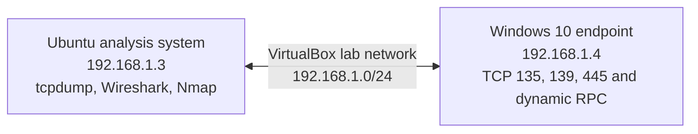

# Lab Architecture

## Environment

| System | Address | Function |
|---|---:|---|
| Ubuntu analysis system | `192.168.1.3` | Runs `tcpdump`, Wireshark and Nmap |
| Windows 10 endpoint | `192.168.1.4` | Provides the target services for controlled scanning |
| VirtualBox network | `192.168.1.0/24` | Isolated lab segment |

## Diagram

## Capture Runs

- **Run 01:** baseline traffic capture
- **Run 02:** controlled TCP SYN reconnaissance against the Windows endpoint

## Analysis Boundary

The capture supports a network service discovery finding. It does not show credential use, exploitation or an interactive remote session.
